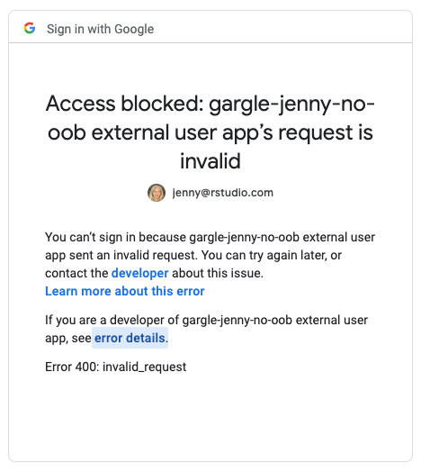
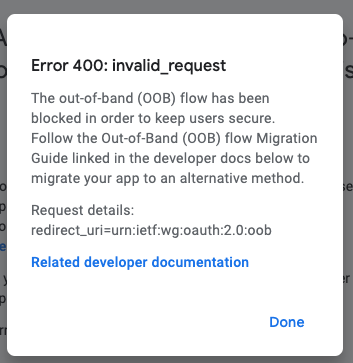

Adjusting to the deprecation of out-of-bound auth
================

## Background

### gargle context

Google is deprecating the out-of-bound (OOB) auth flow.

Out-of-bound auth has been important to gargle users working
interactively on RStudio Cloud, RStudio Server, and RStudio Workbench
(formerly RStudio Server Pro). Building on its origins in the httr
package, gargle has always used the flow documented as [OAuth 2.0 for
Mobile & Desktop
Apps](https://developers.google.com/identity/protocols/oauth2/native-app).

> Installed apps are distributed to individual devices, and it is
> assumed that these apps cannot keep secrets. They can access Google
> APIs while the user is present at the app or when the app is running
> in the background.
>
> This authorization flow is similar to the one used for web server
> applications. The main difference is that installed apps must open the
> system browser and supply a local redirect URI to handle responses
> from Google’s authorization server.

When the user is interacting with server-hosted RStudio via their web
browser, we can’t execute our preferred OAuth flow for “normal” users,
which is to point their web browser to a specific URL (Google’s
authorization server) and open a local webserver on port 1410 to listen
for the response (achieved via the httpuv package).

Instead, in the server setting, gargle has used OOB auth. After
concluding their business with Google’s authorization server, the user
is prompted to copy a validation code and paste it back into the waiting
R session.

This OOB flow is what’s being deprecated. OOB **will still work** in
many contexts, if the user is willing and able to configure their own
OAuth app (client id and secret) and can accept that the app will be
limited to a well-defined set of users. *I am actively conducting
experiments here and will obviously be writing more about this.*

Unfortunately, that leaves a lot of users who will still want to use the
built-in OAuth app that is magically available to them in packages like
bigrquery, googledrive, and googlesheets4.

gargle issue where we are tracking this:
<https://github.com/r-lib/gargle/issues/202>

### Communications from Google

The best, current developer-facing document about OOB deprecation:
<https://developers.google.com/identity/protocols/oauth2/resources/oob-migration>

Key dates:

-   February 28, 2022 - new OAuth usage blocked for the OOB flow. *This
    means that OAuth apps (a client id + secret) created after this date
    are incapable of OOB, out of the gate. I have confirmed this
    behaviour.*
-   September 5, 2022 - a user-facing warning message may be displayed
    to non-compliant OAuth requests. *FWIW I have not seen this (yet) in
    my limited experiments.*
-   October 3, 2022 - the OOB flow is deprecated for OAuth clients
    created before February 28, 2022. *This will impact some R/RStudio
    users who have been using gargle with their own OAuth app created
    before Feb 28 2022.*
-   February 1, 2023 - the OOB flow is deprecated “with no exceptions or
    extensions”. *I applied for and was granted an OOB extension for the
    verified GCP project / OAuth app used in
    bigrquery/googledrive/googesheets4. This is when I expect OOB to
    stop working for that app.*

The only migration strategy provided by Google for the “Desktop client”
flow that we use is exactly what we’ve always done and precisely the
thing we can’t do on our server products:

> If you determine that your app is using the OOB flow on a desktop
> client, you should migrate to using the loopback IP address (localhost
> or 127.0.0.1) flow.

## Setup

*Good place to document creating a new GCP project, enabling a sensitive
API (like Drive), configuring the OAuth consent screen (testing
vs. production, internal user vs external user, test users), and
creating a new OAuth 2.0 client id.*

All starts here:

<https://console.developers.google.com>

## OOB (failure) walkthrough

Setup

-   Recently-created GCP project. So, not grandfathered into OOB.
-   Drive API is enabled, because I’m using googledrive to conduct these
    experiments.
-   OAuth consent screen (despite the name, this is really a more
    general configuration point for the GCP project)
    -   Publishing status: In production
    -   User type: External
    -   (It will say that the app requires verification.)

I’m working on RStudio Workbench (colorado.rstudio.com).

The `email = NA` in my auth calls just causes gargle-wrapping packages
to force a full OAuth dance, i.e. to skip checking for a cached token
that can be possibly be refreshed.

``` r
library(googledrive)

# redacting the key and secret here
the_app <- httr::oauth_app(
  "gargle-jenny-no-oob-alpaca",
  key = "xxx",
  secret = "xxx"
)

# tell googledrive to auth with this app
drive_auth_configure(app = the_app)

# confirm the configuration has worked
drive_oauth_app()

# force a new user OAuth flow
# this fails because of OOB being shut down
drive_auth(email = NA)
```

When we are sent to the browser, where we usually interact with Google’s
authentication and authorization machinery, we just see this:



The text says:

> Access blocked: gargle-jenny-no-oob external user app’s request is
> invalid
>
> You can’t sign in because gargle-jenny-no-oob external user app sent
> an invalid request. You can try again later, or contact the developer
> about this issue. Learn more about this error
>
> If you are a developer of gargle-jenny-no-oob external user app, see
> error details.
>
> Error 400: invalid_request

If you click to see error details, you see this:



The text says:

> Error 400: invalid_request
>
> The out-of-band (OOB) flow has been blocked in order to keep users
> secure. Follow the Out-of-Band (OOB) flow Migration Guide linked in
> the developer docs below to migrate your app to an alternative method.
>
> Request details: redirect_uri=urn:ietf:wg:oauth:2.0:oob

The “related developer documentation” is the link provided earlier.

Meanwhile, back in R, we’re just waiting for an authorization code that
will never come.

    > drive_auth(email = NA)
    Enter authorization code: 

In particular, there’s no error I can catch in gargle and do anything
productive with.

Now I’m going to use the debugger to get more specifics about what
happens on the R side.

``` r
debug(httr::oauth_exchanger)
drive_auth(email = NA)
```

Call stack when we enter `httr::oauth_exchanger()`, starts in
googledrive, passes through gargle, and eventually lands in httr:

    Browse[2]> where
    where 1: oauth_exchanger(url)
    where 2: oauth_authorize(authorize_url, use_oob)
    where 3: init_oauth2.0(self$endpoint, self$app, scope = self$params$scope, 
        user_params = self$params$user_params, type = self$params$type, 
        use_oob = self$params$use_oob, oob_value = self$params$oob_value, 
        use_basic_auth = self$params$use_basic_auth, config_init = self$params$config_init, 
        client_credentials = self$params$client_credentials, query_authorize_extra = self$params$query_authorize_extra)
    where 4: super$init_credentials()
    where 5: self$init_credentials()
    where 6: initialize(...)
    where 7: Gargle2.0$new(email = email, app = app, package = package, params = params, 
        credentials = credentials, cache_path = cache)
    where 8: gargle2.0_token(app = app, scope = scopes, package = package, 
        ...)
    where 9: f(scopes, ...)
    where 10: doTryCatch(return(expr), name, parentenv, handler)
    where 11: tryCatchOne(expr, names, parentenv, handlers[[1L]])
    where 12: tryCatchList(expr, names[-nh], parentenv, handlers[-nh])
    where 13: doTryCatch(return(expr), name, parentenv, handler)
    where 14: tryCatchOne(tryCatchList(expr, names[-nh], parentenv, handlers[-nh]), 
        names[nh], parentenv, handlers[[nh]])
    where 15: tryCatchList(expr, classes, parentenv, handlers)
    where 16: tryCatch(f(scopes, ...), warning = function(e) {
        gargle_debug(c("Warning caught by {.fun token_fetch}:", e$message))
        NULL
    }, error = function(e) {
        gargle_debug(c("Error caught by {.fun token_fetch}:", e$message))
        NULL
    })
    where 17: gargle::token_fetch(scopes = scopes, app = drive_oauth_app() %||% 
        gargle::tidyverse_app(), email = email, path = path, package = "googledrive", 
        cache = cache, use_oob = use_oob, token = token)
    where 18: drive_auth(email = NA)

Incoming value of `request_url` (with client id redacted):

    Browse[2]> request_url
    [1] "https://accounts.google.com/o/oauth2/auth?client_id=xxx&scope=https%3A%2F%2Fwww.googleapis.com%2Fauth%2Fdrive%20https%3A%2F%2Fwww.googleapis.com%2Fauth%2Fuserinfo.email&redirect_uri=urn%3Aietf%3Awg%3Aoauth%3A2.0%3Aoob&response_type=code"

## Non-OOB (failure) walkthrough

Same setup as before, still on Workbench, except now I’ll request that
gargle *not* use OOB (so this is also doomed).

``` r
debug(httr::oauth_listener)
drive_auth(email = NA, use_oob = FALSE)
```

Call stack when we enter `httr::oauth_listener()`:

    Browse[2]> where
    where 1: oauth_listener(url)
    where 2: oauth_authorize(authorize_url, use_oob)
    where 3: init_oauth2.0(self$endpoint, self$app, scope = self$params$scope, 
        user_params = self$params$user_params, type = self$params$type, 
        use_oob = self$params$use_oob, oob_value = self$params$oob_value, 
        use_basic_auth = self$params$use_basic_auth, config_init = self$params$config_init, 
        client_credentials = self$params$client_credentials, query_authorize_extra = self$params$query_authorize_extra)
    where 4: super$init_credentials()
    where 5: self$init_credentials()
    where 6: initialize(...)
    where 7: Gargle2.0$new(email = email, app = app, package = package, params = params, 
        credentials = credentials, cache_path = cache)
    where 8: gargle2.0_token(app = app, scope = scopes, package = package, 
        ...)
    where 9: f(scopes, ...)
    where 10: doTryCatch(return(expr), name, parentenv, handler)
    where 11: tryCatchOne(expr, names, parentenv, handlers[[1L]])
    where 12: tryCatchList(expr, names[-nh], parentenv, handlers[-nh])
    where 13: doTryCatch(return(expr), name, parentenv, handler)
    where 14: tryCatchOne(tryCatchList(expr, names[-nh], parentenv, handlers[-nh]), 
        names[nh], parentenv, handlers[[nh]])
    where 15: tryCatchList(expr, classes, parentenv, handlers)
    where 16: tryCatch(f(scopes, ...), warning = function(e) {
        gargle_debug(c("Warning caught by {.fun token_fetch}:", e$message))
        NULL
    }, error = function(e) {
        gargle_debug(c("Error caught by {.fun token_fetch}:", e$message))
        NULL
    })
    where 17: gargle::token_fetch(scopes = scopes, app = drive_oauth_app() %||% 
        gargle::tidyverse_app(), email = email, path = path, package = "googledrive", 
        cache = cache, use_oob = use_oob, token = token)
    where 18: drive_auth(email = NA, use_oob = FALSE)

Incoming value of `request_url` (with client id and state redacted):

    Browse[2]> request_url
    [1] "https://accounts.google.com/o/oauth2/auth?client_id=xxx&scope=https%3A%2F%2Fwww.googleapis.com%2Fauth%2Fdrive%20https%3A%2F%2Fwww.googleapis.com%2Fauth%2Fuserinfo.email&redirect_uri=http%3A%2F%2Flocalhost%3A1410%2F&response_type=code&state=xxx"

Then, obviously, on Workbench, things fail because the response can’t be
handled, i.e. there is no valid listener.

Let’s do that again, but on my local machine. This works. `request_url`
is the same and here’s indicative `info` yielded from the listener:

    Browse[2]> info
    $state
    [1] "xxx"

    $code
    [1] "xxx"

    $scope
    [1] "email https://www.googleapis.com/auth/drive https://www.googleapis.com/auth/userinfo.email openid"

    $authuser
    [1] "0"

    $hd
    [1] "rstudio.com"

    $prompt
    [1] "consent"
