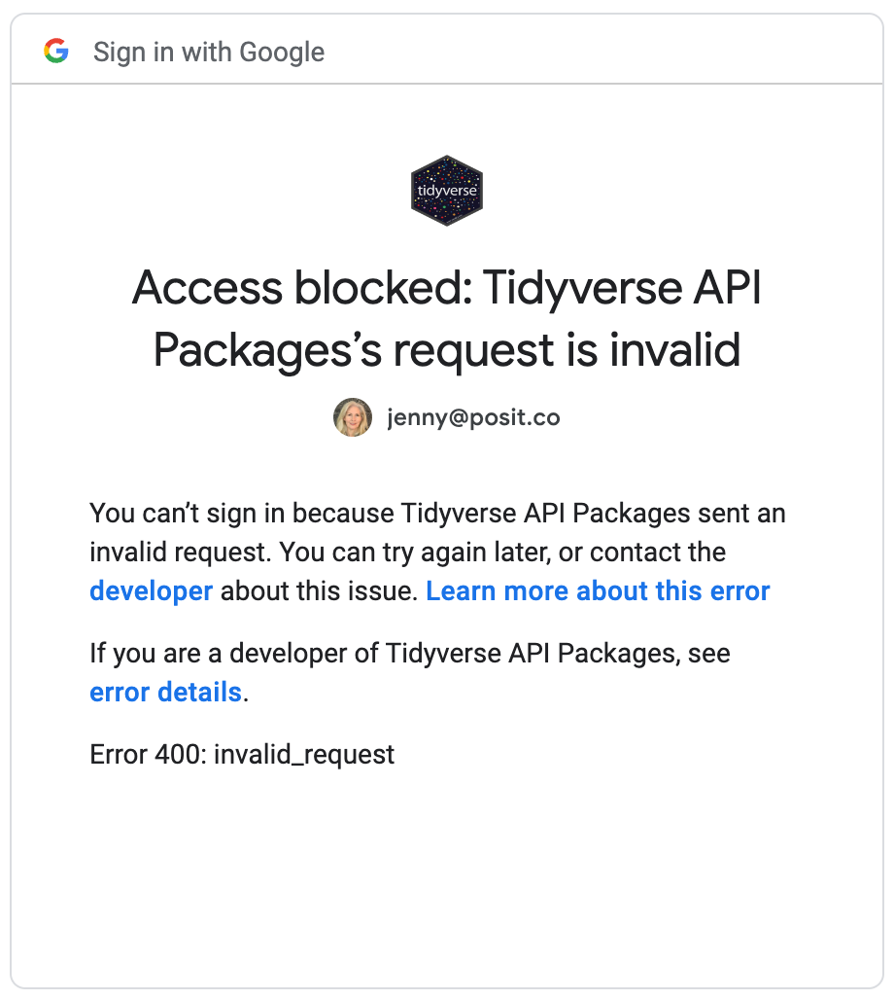

```{r, include = FALSE}
knitr::opts_chunk$set(
  collapse = TRUE,
  comment = "#>"
)
```

If you are working with R in a web-based context, such as [RStudio Server](https://posit.co/download/rstudio-server/), [Posit Cloud](https://posit.cloud/), [Posit Workbench](https://posit.co/products/enterprise/workbench/), or [Google Colaboratory](https://colab.research.google.com/), your experience of browser-based auth flows will be different from those using R on their local machine.
You need to use **out-of-band authentication**, sometimes denoted "oob" or "OOB".
After the usual auth dance, instead of seeing "authentication successful, return to R!", you are presented with an authorization code to copy and paste back into your R session.
For folks who are running R on their local machine, this final exchange can be done automagically, using a temporary local webserver, but that is not possible for those accessing a remote R session through the browser.

On February 16, 2022, Google announced the (partial) deprecation of the OAuth out-of-band (OOB) flow, to be enacted no later than February 1, 2023.
The deprecation applies to Google Cloud Platform (GCP) projects that are in production mode.
OOB still works for projects that are in testing mode.

The built-in tidyverse client (used by googledrive, googlesheets4, and bigrquery) is associated with a GCP project that is in production mode.
Therefore, conventional OOB auth stopped working for the built-in client in February 2023. 
In anticipation of this, gargle gained a new auth flow in version 1.3.0 that we call "pseudo-OOB", which should allow casual users to continue to enjoy a low-friction auth experience, even from RStudio Server, Posit Cloud, Posit Workbench, and Google Colaboratory.

If you attempt to do conventional OOB auth with a client that no longer supports it, you'll see something like this:

```{r, echo = FALSE, out.width = "400px"}
#| fig-cap: >
#|   Access blocked: Tidyverse API Packages's request is invalid.
#|   Error 400: invalid_request
#| fig-alt: >
#|   Screenshot with the following text: "Access blocked: Tidyverse API
#|   Packages's request is invalid", "You can't sign in because Tidyverse API
#|   Packages sent an invalid request. You can try again later, or contact the 
#|   developer about this issue. Learn more about this error", "If you are a
#|   developer of Tidyverse API Packages, see error details.", "Error 400:
#|   invalid_request".

```

If you work on any of the affected platforms and are experiencing new auth problems, your first move should be to update all packages involved (gargle and one or more of googledrive, googlesheets4, bigrquery).
**Restart R.**
Re-execute your code in an interactive context that will allow you to re-auth.

This vignette documents various matters around OOB auth, both conventional and pseudo-OOB, for users who want to understand this more deeply.

Some of the packages that use gargle for auth and for which this article applies:

  * [bigrquery](https://bigrquery.r-dbi.org)
  * [googledrive](https://googledrive.tidyverse.org)
  * [googlesheets4](https://googlesheets4.tidyverse.org)
  * [gmailr](https://gmailr.r-lib.org) *note: gmailr does not use the built-in
    tidyverse OAuth client*

## Consider using a service account token (or no token!)

If you have concerns about using OOB auth, consider whether your task truly requires auth as a specific, normal user.

Can the task be completed with _no auth_, i.e. you are accessing something that is world readable or readable for "anyone with a link"?
In that case, the wrapper package probably provides a function to go into a de-authorized state, such as `googledrive::drive_deauth()` or `googlesheets4::gs4_deauth()`.

If the task requires auth, consider whether it really must be as a specific user.
You may be able to accomplish the task with a service account, which you create for this specific purpose.
A service account token is much easier to work with on a server and in non-interactive contexts than a user token.
A service account can also be given much more selective permissions than a user account and can be more easily deleted, once it is no longer needed.
Remember that the service account will need to be explicitly given permission to access any necessary resources (e.g. permission to read or write a specific Drive file or Sheet).
A service account doesn't somehow inherit permissions indirectly from the user who owns the GCP project in which it lives.
To learn more about using a service account, see `vignette("non-interactive-auth")`.

## When and how to use OOB

In the absence of any user instructions, the function `gargle::gargle_oob_default()` is used to decide whether to use OOB auth.
By default, OOB auth is used on RStudio Server, Posit Cloud, Posit Workbench, and Google Colaboratory, or if the option `"gargle_oob_default"` is set to `TRUE`.
(Note that we use the term "OOB auth" here to include both the existing, conventional form of OOB and gargle's new pseudo-OOB.)

Wrapper packages generally also allow the user to opt-in to OOB auth when making a direct call to an auth function.
For example, the functions `googledrive::drive_auth()`, `googlesheets4::gs4_auth()`, `bigrquery::bq_auth()`, and `gmailr::gm_auth()` all have a `use_oob` argument.
Notably, all of these `use_oob` arguments default to `gargle::gargle_oob_default()`.

gargle usually automatically detects when it should use OOB auth, but here is what it could look like if we are not using OOB, but should be. During auth, you are redirected to localhost on port 1410 and receive an error along these lines:

```
Chrome: This site can't be reached; localhost refused to connect.
Firefox: Unable to connect; can't establish a connection.
```

If this happens you might need to explicitly request OOB.
Below we review two different methods.

## Request OOB auth in the `PKG_auth()` call

Packages like googledrive and bigrquery aim to make auth "just work" for most users, i.e. it's automatically triggered upon first need.
However, it is always possible to initiate auth yourself, which gives you the opportunity to specify non-default values of certain parameters.
Here's how you could request OOB auth, using googledrive as an example:

```{r eval = FALSE}
library(googledrive)

drive_auth(use_oob = TRUE)

# now carry on with your work
drive_find(n_max = 5)
```

## Set the `"gargle_oob_default"` option

If you know that you *always* want to use OOB, as a user or within a project, the best way to express this is to set the `"gargle_oob_default"` option.

```{r eval = FALSE}
options(gargle_oob_default = TRUE)
```

This code could appear at the top of a script, in a setup chunk for `.Rmd`, or in a Shiny app.
But it probably makes even more sense in a `.Rprofile` startup file, at the user or project level.

Once the `"gargle_oob_default"` option has been set, it is honored by downstream calls to `PKG_auth()`, explicit or implicit, because the default value of `use_oob` is `gargle::gargle_oob_default()`, which consults the option.

## Conventional vs. pseudo-OOB auth

gargle now supports two OOB flows, which we call "conventional OOB" (the existing, legacy OOB flow) and "pseudo-OOB" (the new flow introduced in response to the partial deprecation of conventional OOB).
If we are using OOB auth, the decision between conventional or pseudo-OOB is made based on the currently configured OAuth client.

* If the OAuth client is of type `"installed"` (shows as "Desktop" in Google
  Cloud Console) or is of unknown type, gargle uses conventional OOB. Note that
  this will not necessarily succeed, due to the deprecation process described
  above.
* If the OAuth client is of type `"web"` (shows as "Web application" in Google
  Cloud Console), gargle uses the new pseudo-OOB flow.

```{=html}
<style>
  table {
    border-collapse: collapse;
    border-style: none;
  }
  
  .empty-cell {
    border: none;
    background-color: transparent;
  }
  
  table thead {
    background-color: transparent;
  }
  
  table th, table td {
    border-style: solid;
  }
</style>


<table>
  <thead>
    <tr>
      <th class="empty-cell"></th>
      <th class="empty-cell"></th>
      <th colspan="2"><verb>use_oob</verb></th>
    </tr>
    <tr>
      <th class="empty-cell"></th>
      <th class="empty-cell"></th>
      <th>FALSE</th>
      <th>TRUE</th>
    </tr>
  </thead>
  <tbody>
    <tr>
      <th rowspan="2">client type</th>
      <th>installed</th>
      <td>use httpuv to spin up<br> a temporary web server</td>
      <td>conventional OOB</td>
    </tr>
    <tr>
      <th>web</th>
      <td>--not possible--</td>
      <td>pseudo-OOB</td>
    </tr>
  </tbody>
</table>
```

Packages that use a built-in tidyverse OAuth client (googledrive, googlesheets4, and bigrquery) should automatically select a "web" client on RStudio Server, Posit Cloud, Posit Workbench, and Google Colaboratory and an "installed" client otherwise.
If you need to explicitly request a "web" client in some other setting, you can use the global option `"gargle_oauth_client_type"`:

```{r eval = FALSE}
options(gargle_oauth_client_type = "web")
```

Users who configure their own OAuth client will need to be intentional when choosing the client type, depending on where the code is running.

On the R side, it is recommended to setup an OAuth client using `gargle_oauth_client_from_json()`, which allows the client type (`"installed"` vs. `"web"`) to be detected programmatically from the downloaded JSON.
The less-preferred approach is to use `gargle_oauth_client()` and provide the information yourself.

## How pseudo-OOB works

Pseudo-OOB works just like non-OOB and conventional OOB in terms of the user's interactions with Google authorization server.
This is where the user authenticates themselves with Google and consents to the type of access being requested by the R code.

These flows differ in how they handle a successful response from the authorization server.
Specifically, the flows use different redirect URIs.

* A (temporary) local webserver is used to listen for this response at, e.g.,
  `http://localhost:1410/` if R is running locally and the httpuv package is
  available (i.e. a non-OOB flow).
* In conventional OOB, a special redirect value is used, typically
  `urn:ietf:wg:oauth:2.0:oob`, and the authorization code is provided to the
  user via a browser window for manual copy/paste. This page is served by
  Google. Google has deprecated conventional OOB for projects in production
  mode (but it is still allowed for projects in testing mode).
* In gargle's pseudo-OOB, a redirect URI from the configured OAuth client is
  used to receive the response. This page is responsible for exposing a code
  that the user can copy/paste, similar to conventional OOB (except the page is
  *not* served by Google). Unlike conventional OOB, this is not the
  authorization code itself, but is something from which the code can be
  extracted, along with a state token to mitigate cross-site request forgery.
  This is actually implemented using an [OAuth flow for web server applications](https://developers.google.com/identity/protocols/oauth2/web-server).
  Note that we (gargle) call this pseudo-OOB, but it is not technically OOB from
  Google's point-of-view.
  
The built-in OAuth client used for pseudo-OOB by tidyverse packages redirects to <https://www.tidyverse.org/google-callback/>.
This is a static landing page that does not collect any data and exists solely to give the interactive R user a way to convey the authorization token back to the waiting R process and thereby complete the auth process.

### More details about the deprecation of conventional OOB

Key links:

* Blog post: [Making Google OAuth interactions safer by using more secure OAuth flows](https://developers.googleblog.com/2022/02/making-oauth-flows-safer.html)
* [Out-Of-Band (OOB) flow Migration Guide](https://developers.google.com/identity/protocols/oauth2/resources/oob-migration#web-application)
* [Using OAuth 2.0 to Access Google APIs](https://developers.google.com/identity/protocols/oauth2)

## But I didn't need OOB yesterday!

Sometimes the usual OAuth web flow suddenly stops working for people working directly with R (so NOT via the browser) and they use OOB auth to get unstuck again.
What's going on in this case?

The initial error looks something like this:

```
createTcpServer: address already in use
Error in httpuv::startServer(use$host, use$port, list(call = listen)) : 
  Failed to create server
```

It's characteristic of some other process sitting on port 1410, which is what gargle is trying to use for auth.

It's true that using OOB auth is a workaround.
But OOB auth is, frankly, more clunky, so why use it if you don't have to?
Here are ways to fix this.

  * Restart your system. This will almost certainly kill the offending process,
    which is usually a zombie process.
  * Hunt down the offending process, verify it looks expendable, and kill it.

On *nix-y systems, use `lsof` to get the process ID:

```
sudo lsof -i :1410
```

The output will look something like this:

```
COMMAND   PID  USER   FD   TYPE            DEVICE SIZE/OFF NODE NAME
R       16664 jenny   20u  IPv4 0x63761a50856c65f      0t0  TCP localhost:hiq (LISTEN)
```

In this case, as is typical, this is a zombie R process and I feel confident killing it.
The process ID is listed there as PID.
Note that and kill the process, like so, filling in the PID you found:

```
kill -9 <PID>
```

So, to be clear, in this example, the command would be:

```
kill -9 16664
```

The normal, non-OOB auth web flow should work again now.

## Further reading

If you're working on a data product that will be deployed (for example on [shinyapps.io](https://www.shinyapps.io) or [Posit Connect](https://posit.co/products/enterprise/connect/)), you will also need to consider how the deployed content will authenticate non-interactively, which is covered in `vignette("non-interactive-auth")`.
