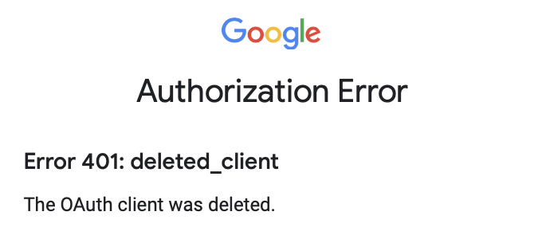

```{r, include = FALSE}
knitr::opts_chunk$set(
  collapse = TRUE,
  comment = "#>"
)
```

```{r setup}
library(gargle)
```

## `"gargle_verbosity"` option

There is a package-wide option that controls gargle's verbosity: `"gargle_verbosity"`.
The function `gargle_verbosity()` reveals the current value:

```{r}
gargle_verbosity()
```

It defaults to `"info"`, which is fairly quiet.
This is because gargle is designed to try a bunch of auth methods (many of which will fail) and persist doggedly until one succeeds.
If none succeeds, gargle tries to guide the user through auth or, in a non-interactive session, it throws an error.

If you need to see all those gory details, set the `"gargle_verbosity"` option to `"debug"` and you'll get much more output as gargle works through various auth approaches.
It is **normal** to see lots of errors, as gargle tries various auth methods in succession, most of which will often fail.

```{r}
# save current value
op <- options(gargle_verbosity = "debug")

gargle_verbosity()

# restore original value
options(op)
```

Note there are also withr-style helpers: `with_gargle_verbosity()` and `local_gargle_verbosity()`.

```{r}
gargle_verbosity()

with_gargle_verbosity(
  "debug",
  gargle_verbosity()
)

gargle_verbosity()

f <- function() {
  local_gargle_verbosity("debug")
  gargle_verbosity()
}

f()

gargle_verbosity()
```

## `gargle_oauth_sitrep()`

`gargle_oauth_sitrep()` provides an OAuth2 "situation report".

`gargle_oauth_sitrep()` is only relevant to OAuth2 user tokens.
If you are using (or struggling to use) a service account token, workload identity federation, Application Default Credentials, or credentials from the GCE metadata service, `gargle_oauth_sitrep()` isn't going to help you figure out what's going on.

Here is indicative output of `gargle_oauth_sitrep()`, for someone who has accepted the default OAuth cache location and has played with several APIs via gargle-using packages.

```{r, eval = FALSE}
gargle_oauth_sitrep()
#' > 14 tokens found in this gargle OAuth cache:
#' '~/Library/Caches/gargle'
#' 
#' email                         app         scope                          hash...   
#' ----------------------------- ----------- ------------------------------ ----------
#' abcdefghijklm@gmail.com       thingy      ...bigquery, ...cloud-platform 128f9cc...
#' buzzy@example.org             gargle-demo                                15acf95...
#' stella@example.org            gargle-demo ...drive                       4281945...
#' abcdefghijklm@gmail.com       gargle-demo ...drive                       48e7e76...
#' abcdefghijklm@gmail.com       tidyverse                                  69a7353...
#' nopqr@ABCDEFG.com             tidyverse   ...spreadsheets.readonly       86a70b9...
#' abcdefghijklm@gmail.com       tidyverse   ...drive                       d9443db...
#' nopqr@HIJKLMN.com             tidyverse   ...drive                       d9443db...
#' nopqr@ABCDEFG.com             tidyverse   ...drive                       d9443db...
#' stuvwzyzabcd@gmail.com        tidyverse   ...drive                       d9443db...
#' efghijklmnopqrtsuvw@gmail.com tidyverse   ...drive                       d9443db...
#' abcdefghijklm@gmail.com       tidyverse   ...drive.readonly              ecd11fa...
#' abcdefghijklm@gmail.com       tidyverse   ...bigquery, ...cloud-platform ece63f4...
#' nopqr@ABCDEFG.com             tidyverse   ...spreadsheets                f178dd8...
```

It is relatively harmless to delete the folder serving as the OAuth cache.
Or, if you have reason to believe one specific cached token is causing you pain, you could delete a specific token (an `.rds` file) from the cache. OAuth user tokens are meant to be perishable and replaceable.

If you choose to delete your cache (or a specific token), here is the fallout you can expect:

  * You will need to re-auth (usually, meaning the browser dance) in projects
    that have been using the deleted tokens.
  * If you have `.R` or `.Rmd` files that you execute or render
    non-interactively, presumably with code such as
    `PKG_auth(email = "janedoe@example.com")`, those won't run non-interactively
    until you've obtained and cached a token for the package and that
    identity (email) interactively once.

## Why do good tokens go bad?

Sometimes it feels like auth was working and then suddenly it stops working.
If you've cached a token and used it successfully, why would it stop working?

### Too many tokens

An existing token can go bad if you've created too many Google tokens, causing your oldest tokens to "fall off the edge".

A specific Google user (email) can only have a certain number of OAuth tokens at a time (something like 50 per OAuth client).
So, whenever you get a new token (as opposed to refreshing an existing token), there is the potential for it to invalidate an older token.
This is unlikely to be an issue for a casual user, but it can absolutely become noticeable for someone who is developing against a Google API or someone working from many different machines / caches.

Another reason that an existing token stops working is if it was obtained with an OAuth client that is in "testing" mode.
Refresh tokens obtained that way only last for one week, whereas it's more typical for refresh tokens to last almost indefinitely (or, at least, for several months).

### Credential rolling

Many users of packages like googlesheets4 or googledrive tacitly rely on the default OAuth client used by those packages.
Periodically the maintainer of such a package will need to roll the client, i.e. create a new OAuth client and disable the old one.
This will make it impossible to refresh existing tokens, made with the old, disabled client
Those tokens will stop working.

*In gargle v1.0.0, in March 2021, we rolled the client used in googlesheets4, googledrive, and bigrquery.
We reserve the right to disable the old client at any time.
Anyone relying on the default client will have to upgrade.*

The solution is to update the package in question, e.g. googlesheets4:

```{r eval = FALSE}
install.packages("googlesheets4")
```

**Restart R!**
Resume your work.
Chances are you'll be prompted to re-auth with the new client and you'll be back in business.

What does this problem look like in the wild?

With gargle versions up to v1.0.0, you will probably see this:

```
Auto-refreshing stale OAuth token.
Error in get("refresh_oauth2.0", asNamespace("httr"))(self$endpoint, self$app,  :
  Unauthorized (HTTP 401).
```

If you're trying to create a token, instead of refreshing one, you might see this in the browser, while R is waiting to receive input:

```
Google Authorization Error

Error 401: deleted_client
The OAuth client was deleted.
```

It might look something like this:

```{r, echo = FALSE, out.width = "400px"}
#| fig-alt: >
#|   Screenshot with the following text: "Google",
#|   "Authorization Error", "Error 401: deleted_client",
#|   "The OAuth client was deleted."

```

As of gargle version v1.1.0, we're trying harder to recognize this specific problem and to provide a more detailed and actionable error message:

```
Auto-refreshing stale OAuth token.
Error: Client error: (401) UNAUTHENTICATED
  * Request not authenticated due to missing, invalid, or expired OAuth token.
  * Request had invalid authentication credentials. Expected OAuth 2 access token, login cookie or other valid authentication credential. See https://developers.google.com/identity/sign-in/web/devconsole-project.
Run `rlang::last_error()` to see where the error occurred.
In addition: Warning message:
Unable to refresh token, because the associated OAuth app has been deleted
* You appear to be relying on the default app used by the googlesheets4 package
* Consider re-installing googlesheets4 and gargle, in case the default app has been updated
```

## How to avoid auth pain
 
If you have rigged some remote mission critical thing (e.g. a Shiny app or cron job) to use a cached user OAuth token, one day, one of the problems described above will happen and your mission critical token will stop working.
Your thing (e.g. the Shiny app or cron job) will mysteriously fail because the OAuth token can't be refreshed and a new token can't be obtained in a non-interactive setting.
This is why cached user tokens are a poor fit for such applications.

If you choose to use a cached user token anyway, be prepared to deal with this
headache periodically.
(You may not have much of a choice if you are using, for example, the gmailr package to work with the Gmail API, which has limited support for service accounts.)
Consider using your own OAuth client to eliminate your exposure to a third-party deciding to roll their client.
Be prepared to generate a fresh token interactively and upload it to the token cache consulted by your remote mission critical thing.
Better yet, upgrade to a more robust strategy for [non-interactive auth](https://gargle.r-lib.org/articles/non-interactive-auth.html), such as a service account token.

## How to inspect the last response

By default, `gargle::response_process()` stores the most recently processed response in an internal environment.
You can access this response with the nonexported helper `gargle:::gargle_last_response()`.
Prior to storage, a few parts of the response are redacted or deleted, such as the access token and the handle.
These are either sensitive (the token) or useless (the handle) and they have more downside than upside for downstream debugging use.

Here's an example of accessing the most recent response and writing it to file, which could be shared with someone else for debugging.
The response is in this example has HTTP status 200, i.e. it is not an error.
But this process works the same even if in the case of an error, e.g. an HTTP status >= 400.

```{r include = FALSE}
# only run the chunk below in settings that are known to be safe, i.e. where
# occasional, incidental failure is OK
can_decrypt <- gargle::secret_has_key("GARGLE_KEY")
```

```{r eval = can_decrypt, purl = can_decrypt}
library(gargle)

req <- request_build(
  method = "GET",
  path = "webfonts/v1/webfonts",
  params = list(
    sort = "popularity"
  ),
  key = gargle_api_key(),
  base_url = "https://www.googleapis.com"
)
resp <- request_make(req)
out <- response_process(resp)

lr <- gargle:::gargle_last_response()
tmp <- tempfile("gargle-last-response-")
saveRDS(lr, tmp)
# you could share this .rds file with a colleague or the gargle maintainer

# how it would look to complete the round trip, i.e. load this on the other end
rt_lr <- readRDS(tmp)

all.equal(lr, rt_lr)

# clean up
unlink("tmp")
```
